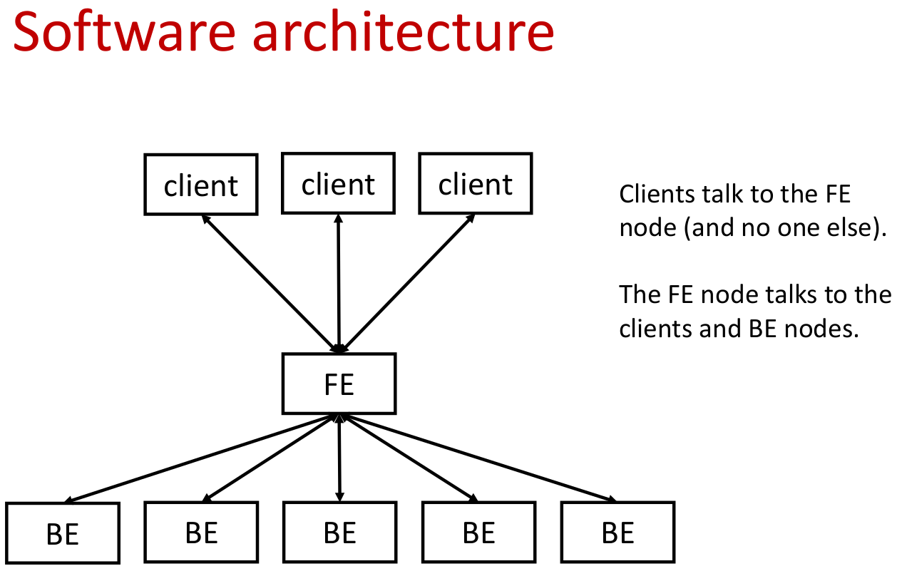

# Distributed Password Hashing
This is a Bcrypt password hashing service which distributes work over 1
frontend node and any number of backend nodes. Load balancing over all nodes is
done to maximize throughput, given the constraint that each node has access to
2 CPU's. Failure of an arbitrary number of backend nodes is tolerated.

